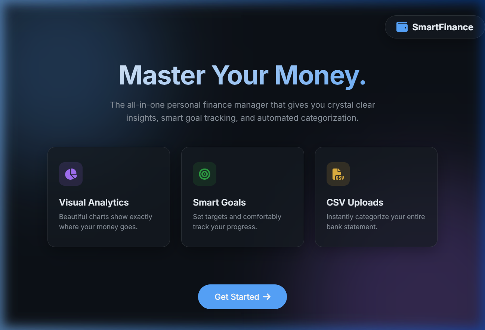
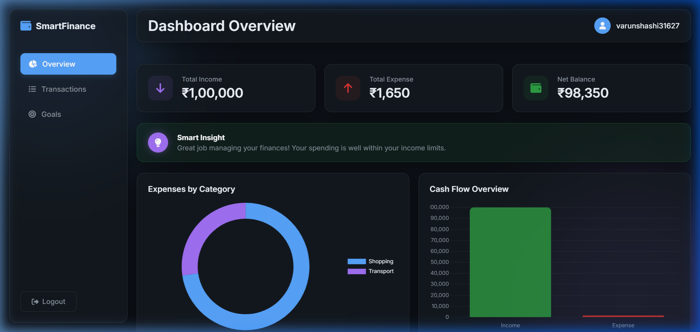
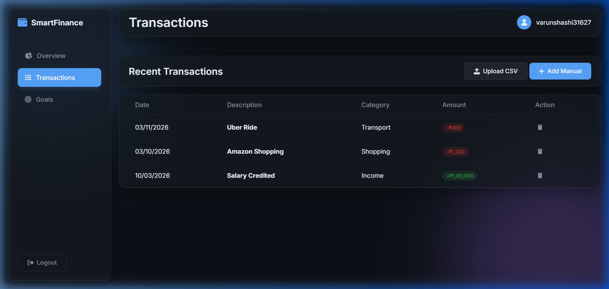

# Smart Personal Finance Manager

A full-stack fintech web application that helps users track expenses, manage budgets, set financial goals, and analyze spending patterns through interactive dashboards.

The platform provides secure authentication, financial data visualization, and CSV-based bulk transaction imports to simplify personal financial management.

## Highlights

- **Full-stack fintech application** built with Node.js, Express, and MongoDB  
- **Secure authentication** using JWT and bcrypt  
- **Interactive financial analytics dashboard** with Chart.js  
- **CSV bulk transaction import** with automatic categorization  
- **Cloud deployment** using Render and MongoDB Atlas

## Live Demo

🔗 **[Live Production](https://smart-personal-finance-manager.onrender.com/)** *(Note: The free Render tier may take 1-2 minutes to wake up on the first visit).*

## Screenshots

### Welcome Entry


### Dashboard Visual Analytics


### Transaction Manager


## Key Features

- **Secure user authentication** with JWT and bcrypt password hashing.
- **Track income and expense transactions** cleanly and efficiently.
- **Financial goal and budget management** with dynamic progress tracking.
- **Interactive dashboards** featuring Chart.js visual financial insights.
- **CSV bulk transaction import** capable of auto-categorizing entire bank statements.
- **Responsive glassmorphism UI** natively optimized for both desktop and mobile views.

## Tech Stack

### Backend
- Node.js
- Express.js
- MongoDB & Mongoose
- JWT Authentication
- bcrypt.js
- multer & csv-parser

### Frontend
- HTML5
- CSS3 (Flexbox, Grid, & CSS Variables)
- Vanilla JavaScript
- Chart.js

### Deployment
- Render (Backend & Static Hosting)
- MongoDB Atlas (Cloud Database)

## System Architecture

```text
Frontend (HTML/CSS/JS)
        ↓
Node.js + Express REST API
        ↓
MongoDB Database (MongoDB Atlas)
        ↓
Cloud Deployment (Render)
```

## Project Structure

```text
models/        → Mongoose database schemas  
routes/        → Express API endpoints  
middleware/    → Authentication middleware  
public/        → Frontend files (HTML, CSS, JS)  
uploads/       → Temporary CSV storage  
server.js      → Main server entry point
```

## Getting Started Locally

### Prerequisites
Make sure you have Node.js and MongoDB installed on your local machine.

### Installation

1. **Clone the repository**
   ```bash
   git clone https://github.com/varunshashidhara/Smart-Personal-Finance-Manager.git
   cd Smart-Personal-Finance-Manager
   ```

2. **Install dependencies**
   ```bash
   npm install
   ```

3. **Set up environment variables**
   Create a `.env` file in the root directory:
   ```env
   PORT=5000
   MONGO_URI=your_mongodb_connection_string
   JWT_SECRET=your_jwt_secret_key
   ```

4. **Start the application**
   ```bash
   node server.js
   ```
   The server will start running on `http://localhost:5000`. Navigation is handled directly through the root port.

## License
This project is licensed under the MIT License. 

Developed By Varun S.
